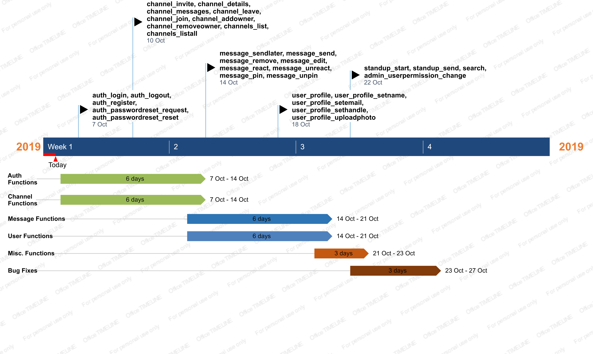

# Plan - ThunderHands

We have decided to split the functions up into 5 different sections. 

We have categorised them as so:
        
        1.  **Auth functions**: auth_login, auth_logout, auth_register, auth_passwordreset_request, auth_passwordreset_reset.
        
        2.  **Channel functions**: channel_invite, channel_details, channel_messages, channel_leave, channel_join, channel_addowner,
            channel_removeowner, channels_list, channels_listall.
            
        3.  **Message functions**: message_sendlater, message_send, message_remove, message_edit, message_react, message_unreact, 
            message_pin, message_unpin.
            
        4.	**User functions**: user_profile, user_profile_setname, user_profile_setemail, user_profile_sethandle, 
            user_profile_uploadphoto.
        
        5.	**Misc. functions**: standup_start, standup_send, search, admin_userpermission_change.

Week 4 will be dedicated to writing up the code for the Auth functions and the Channel functions, since these two have the most functions and are vital to users being able to register an account and start creating channels with other users. These are our base functions as all other functions build off of these and add functionality to them. These are the most important functions for our application to run. Ideally, Auth functions will take 3 days to complete, this leaves the rest of the week to complete Channel functions and fix any other bugs.

Week 5 will focus on furthering what users can do as we will focus on the Message functions and the User functions. These two functions give users important abilities and controls over their profiles and allow them to start using channels properly. These functions are focused on second as they require the two previous functions in order to work. Ideally, Message functions will take 3 days to complete, leaving the rest of the week to complete User functions and fix and bugs that arise.

Week 6 will have Misc. functions implemented, these functions are very specific and do not have a huge effect on the other functions. These functions target specific things that the client wants but do little in changing how the overall program acts and works. They will be focused on last, as they are the least important functions with regards to the applciation running. These should not take long to finish and will be done by wednesday week 6, this will leave us the rest of the week to test out how the functions interact with eachother. This will give us the rest of the week to ensure that the functions interact well with eachother and any bugs will be identified and dealt with. Although, week 6 involves the least important functions, it is the most important week as it gives us the time to ensure all functions act accordingly and the overall application runs as intended.

We have decided to use Visual Studio Code for developing the functions and to ensure simplicity we will only use GitLab for the management of development tasks. Our main form of communication is Facebook Messenger and is where most of our communication takes place, we will continue utilizing these tools as they have worked well so far.
